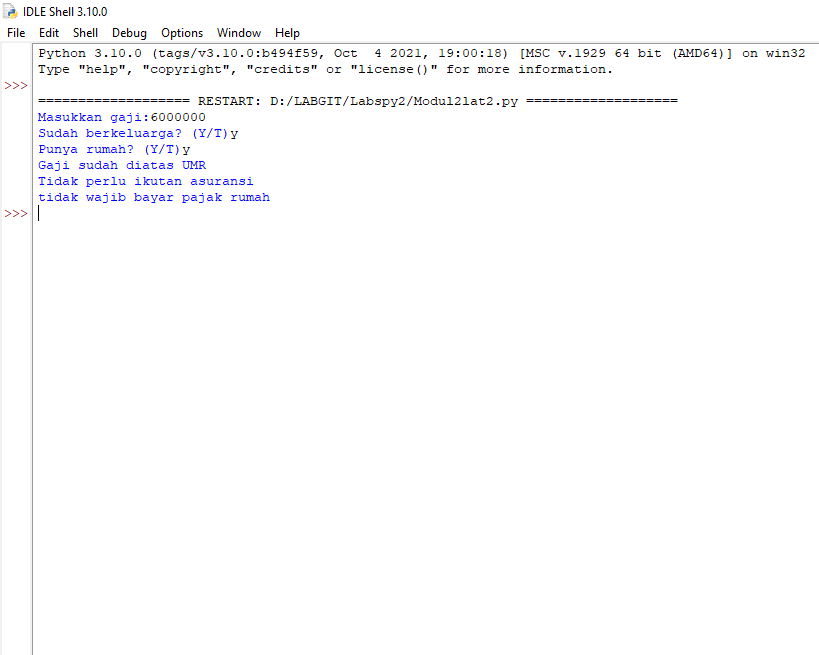

# Labspy2

## Tugas Praktikum 2
### Program input tiga buah bilangan dan menentukan nilai terbesarnya
#### Algoritma menentukan nilai terbesar dari 3 buah bilangan
<li> Diketahui 3 buah bilangan Bil1,Bil2,Bil3 akan dicari nilai terbesar </li>

1. Mulai 

2. Baca nilai a 

3. Baca nilai b 

4. Baca nilai c 

5. Jika a>b dan a>c maka kerjakan langkah nomor 8, selain itu 

6. Jika b>a dan b>c maka kerjakan langkah nomor 9, selain itu kerjakan langkah nomor 10 

7. Cetak "Bilangan terbesar nilai a" 

8. Cetak "Bilangan terbesar nilai b" 

9. Cetak "Bilangan terbesar nilai c" 

10. Selesai 

#### Flowchart

#### Program
<li> Gunakan statement if untuk inisiasi Bilangan Pertama </li>
<li> Gunakan statement elif untuk inisiasi Bilangan Kedua </li>
<li> Gunakan statement else untuk inisiasi Bilangan Ketiga </li>
<li> Kemudian Run Bilangan Ketiga </li>

#### Output

## Latihan 1: Membuat program menentukan nilai akhir
#### Program

#### Output

## Latihan 2: Membuat program menampilkan status gaji karyawan
#### Program

#### Output

## Latihan 3: Penggunaan kondisi OR
### Program membandingkan 3 input bilangan, apabila penjumlahan 2 bilangan hasilnya sama dengan bilangan lainnya, maka cetak pernyataan “Benar”
#### Program

#### Output

### Sekian Terima Kasih